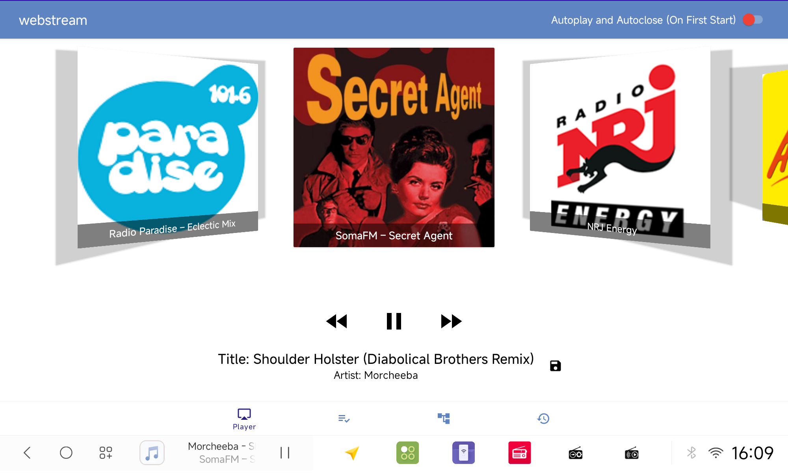
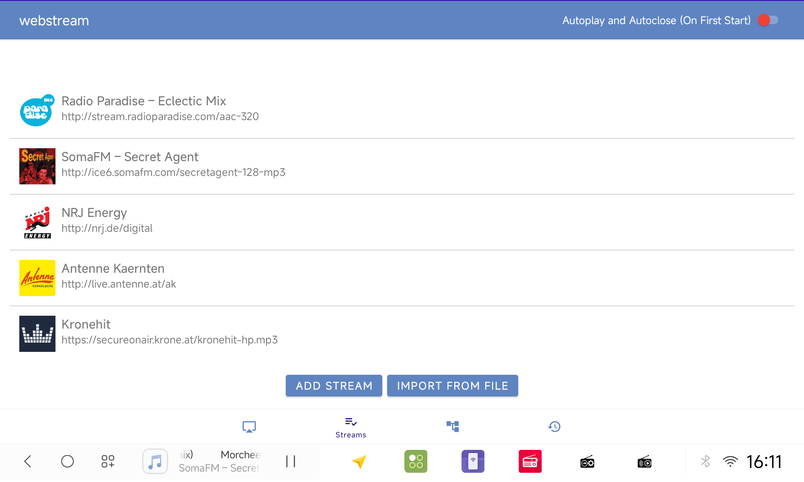
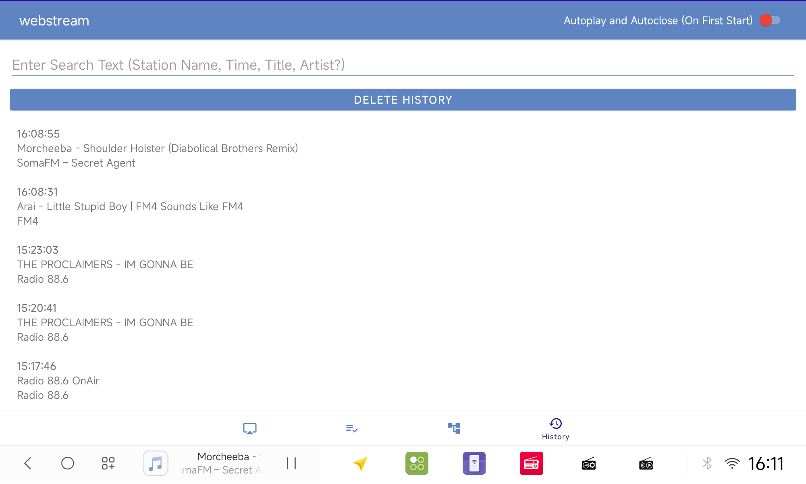

# 📻 WebStream

**WebStream** is a modern Android app for playing internet radio using **ExoPlayer** and **MediaSession**, optimized for background playback and easy station management.

---

## ✅ Features

- 🎧 **Play web streams** using ExoPlayer
- 🕹️ **MediaSession control** – control playback directly from the system or launcher (Play, Pause, Next, Previous)
- 🔁 **Background playback** – the app can automatically move to the background after starting
- 📝 **Meta info logging** – manually or automatically (e.g. artist and title)
- 🕵️ **Track history** – enables searching for songs later (if station provides metadata)
- 🧭 **Clean and simple UI** for managing and playing streams
- 🔊 **AudioFocus support** – pause other media apps when stream starts (optional)
- 🔄 **Import / Export** station list (e.g. as JSON) Drag Drop move Stream to Change Index, Swipe to left to delete on fly
---

## 🔜 Planned Features

-  ⚡ **Shortcut overlay** for quick access to favorite stations
- 🚀 **Autostart after boot** (optional)
- 🖼️ **MediaSession artwork support** – show stream cover in system player
- 🧩 **Better dynamic layouts** – responsive design for various screen sizes

---

## 🐞 Known Bugs

- 🔍 **Selected card in rotary menu is too small**  
  → Needs layout improvement for selected item size
  - 🔄 **Rotary menu and MediaSession does not update when changing Stream Database**  
  - Bugfix with ic_recycle when deleting a stream with swiping to the left
  - When The Rotary Ends it takes forebver to get to the first item when klicking next
---

## 📦 Package Name

`at.plankt0n.webstream`

---

## 🖥️ Designed for Larger Screens

This app is intended for **tablets, car radios (Android Auto devices), or other devices with larger displays**.  
It is **not intended for normal smartphones**.  
Requires at least **API 29 (Android 10)**.

---
## Preview

Some Screenshots:

---

## 🙌 Note

> Most of the work has been done with the help of **ChatGPT**.  
> It's amazing what anyone can create with the right tools – even without being a developer.  
>  
> I'm not a professional developer, so if you have any ideas, improvements, or suggestions for features,  
> **please feel free to share or contribute** – I’d really appreciate your input!
> There are Sampe Import Files for Radio Stations in the Repository
